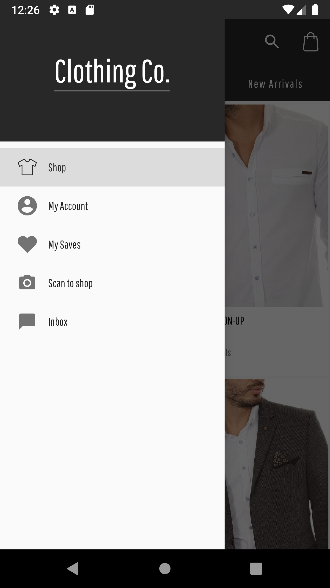
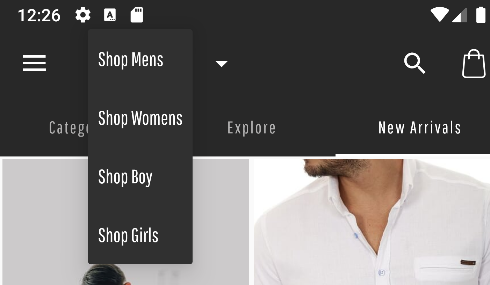
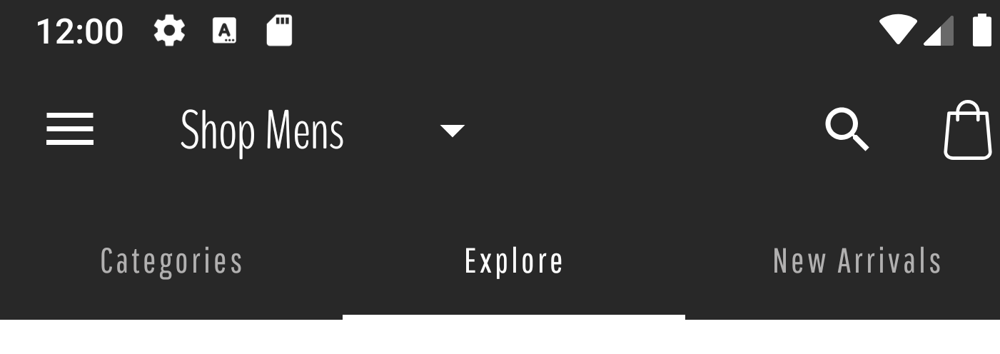
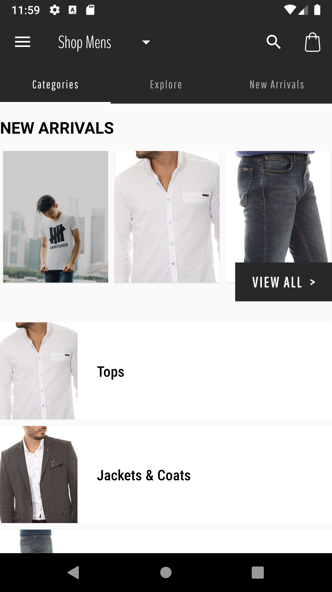

# Retail App
The purpose of this project is to create an Android application for a retail store exemplifying the implementation of common UI components in Android. 
For this project, we will be focusing on the general structure of the app (Drawer and Menus) and the screens for the shopping feature that displays three main sections(Categories, Explore/Promotions and New Arrivals).

## General structure
The general structure for the app consists of the main activity implementing a navigation drawer, a customized toolbar with a spinner.

### Navigation Drawer
Implementation functions and classes:
- MainActivity::setUpStartFragment
- MainActivity::setUpListeners
- MainActivity::setUpDrawer
- MainActivity::onNavItemSelected
- MainActivity::onBackPressed
  
Resources Styles:
- activity_main.xml
- nav_drawer_header.xml
- drawer_menu.xml
  
Styles
- style/HeaderDrawerText

  

### Toolbar/Menu
Implementation functions and classes:
- MAinActivity::onCreateOptionsMenu
- MainActivity::setUpToolbar

Resources Styles:
- spinner_item.xml
- main_activity_top_menu.xml

Styles:
- style/ToolBarSpinnerAppearance

  

## Shopping Feature
The shopping feature consists of a Tab layout with separated fragments for each tab(categoriesFragment, ExploreFragment and NewArrivalsFragment).

### Tab layout
Implementation functions and classes:
- ShoppingFragment::bindTabLayout
- ShoppingPagerAdapter
  
Resources:
- shopping_fragment.xml

Styles:
- style/ShoppingTabLayout
  
  

### New arrivals Tab
This section contains a list of products recently added to the store. 
The implementation consists of a fragment containing a RecyclerView using a GridLayoutManager.

Implementation functions and classes:
- NewArrivalsFragment::setUpLiveData
- NewArrivalsFragment::setUpViews
- NewArrivalsFragment::onNewArrivalsListChanged
- NewArrivalsAdapter
- Extensions:: BigDecimal.toCurrencyString
- NewArrivalsViewModel
  
Resources:
- new_arrivals_fragment.xml
- new_arrivals_list_item.xml
  
Styles:
- style/NewArrivalPriceTag

  

### Explore
This section shows a list of promotional banners and special events of the store.
The implementation consists of a fragment containing a RecyclerView using a LinearLayoutManager.

Implementation functions and classes:
- ExploreFragment::setUpLiveData
- ExploreFragment::setupRecyclerView
- ExploreFragment::updateContent
- ExlporeFragment::onExploreContentReceived
- PromotionsListAdapter
- ContentListAdapter
- ExploreViewModel

Resources:
- explore_fragment.xml
- promotions_recyclerview_item.xml
- content_list_item.xml

  

### Categories
This section contains a summary of the new arrivals in the store, the list of clothing categories and a section for the featured collections from the store. 
The implementation consists of a fragment containing the main RecyclerView with multiple ViewTypes, NewArrivalList, Category, Collection and Section Header.

  
  
 

Implementation functions and classes
- Fragment
  - CategoriesFragment::setupRecyclerView
  - CategoriesFragment::setUpLiveData
  - CategoriesFragment::updateContent
  - CategoriesFragment::onCategoriesTabContentReceived
  - CategoriesFragment::spanSizeLookup
  - CategoriesRecyclerAdapter
  - CategoriesViewModel
  
- New Arrivals
  - CategoriesNewArrivalListHolder
  - CategoriesNewArrivalsRecyclerAdapter
  - Animations::animateViewSlideFromRight

- Category
  - CategoryItemHolder
  - Animations::animateViewSlideFromRight
- Header
  - CategoriesSectionHeaderHolder
- Collection
  - CategoriesCollectionHolder
  
Resources
- Fragment
  - categories_fragment.xml
  - slide_from_left.xml
  - slide_from_right.xml
- New Arrivals
  - category_list_new_arrivals.xml
  - category_new_arrivals_item.xml
- Category
  - category_item.xml
- Header
  - section_header.xml
- Collection
  - category_list_collection_item.xml
  
Styles
- New Arrivals
  - style/SquareButtonStyle
  - style/CategoriesNewArrivalsCard
- Category
  - style/CategoryCardStyle
  - style/CategoryCardText
- Header
  - style/CategoriesTabTitles
- Collection
  - style/CategoryCardText.CollectionCard
  - style/CategoriesCollectionItem

 